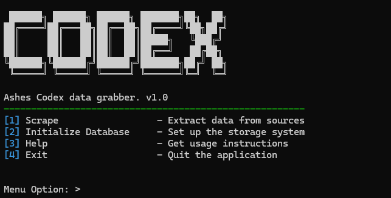

# CodexScraper

CodexScraper is a tool used to access the data from [AshesCodex](https://ashescodex.com/)  

## 🔧 Requirements  
- **Tested Python Version**: Python **>= 3.9** (other versions may work but are not officially tested).  
    Download Python 3.13.2 (Make sure you click `Add to Path`):
- - [Windows](https://www.python.org/ftp/python/3.13.2/python-3.13.2-amd64.exe)
- - [MacOS](https://www.python.org/ftp/python/3.13.2/python-3.13.2-macos11.pkg)
- - [Source](https://www.python.org/ftp/python/3.13.2/Python-3.13.2.tgz)

## 📥 Installation  
1. **Clone the repository**  
   - Open CMD <kbd>Win</kbd> + <kbd>r</kbd>
   - Type `cmd`
   - `cd Desktop` (Or wherever you want to save this to)
   ```sh
   git clone https://github.com/mutim/CodexScraper.git
   cd CodexScraper

2. **Install dependencies**
    - While still in terminal, `cd CodexScraper`
    ```sh
   pip install -r requirements.txt

3. **Running the Program**
    - You will need to run the program for the first time to set-up the `.env` file.
    ```sh
    python main.py
- - This is your first time, so it will exit with the message:
    ```sh
    "No valid .env file found! Creating one now... Please modify this to reflect your data."
- This is what we want. After you get this message, navigate to the directory where you saved the script.
- You should see a new file in here, called `.env`. You can use any text editor to edit this file.
    ```json
    SUPABASE_URL = 'Replace Me! (Keep quotes to escape special characters)'
    SUPABASE_KEY = 'Replace Me! (Keep quotes to escape special characters)'
    
    ASHES_AUTH = 'Make this blank if you are not using it'
    ASHES_KEY = ''
    
    USER = 'postgres.{your_database}'
    PASSWORD = ''
    HOST = ''
    PORT = '6543'
    DBNAME = 'postgres'
We'll fill this out in the next section ^^
## 📚 Database
1. **Setup a Supabase Account**
- Navigate to [Supabase](https://supabase.com/) and create an account.
- On your dashboard, create a `New Project` (note the password in your `.env` file)
- Go to `Project Settings` on the left panel and `Data API`
- Take note of the `URL` and reveal your `service_role` API Key (Copy both into your `.env` file)
- To finish configuration, click on <kbd>Connect</kbd> on the top.
- - Change Type to Python (Easiest way)
- - Scroll all the way down, and copy the `user` and `host` into your `.env` file.
- - (Note you have two ports here. We're using a transaction pooler, so we will use 6543)

## 🚀 Usage
- Ensure that your terminal is still within the CodexScraper directory
- Run the program again using:
    ```
    python main.py
-  
- - If you see raw color codes (\033[0;32m), Try using PowerShell instead (All steps should work the same)
- From this menu, select option <kbd>[2]</kbd>. This will begin to initialize the database table
- Once that is complete, select option <kbd>[1]</kbd>. This takes some time (~1.5-2s a transaction). Be patient!
>**NOTE**: I don't think there is any issue with stopping it early, but you may get incomplete date

### 🎉🎉 That's It! 🎉🎉
You now have your own copy of the [Ashes Codex Database](https://ashescodex.com/db/)! Everything you see is queryable

### Some useful tips and scripts
Make sure you look at the [example_structures](example_structures) to see the data structure of each section. 
This info comes from Intrepid, and can sometimes be not what you would expect. 

Perform live queries! Once you have the DB, you can play around with what you find. 

```sql
SELECT 
    data->>'name' AS item_name,  
    data->>'displayIcon' AS icon
FROM codex WHERE section = 'items' AND
    data::jsonb -> 'itemTypeTags' -> 'parentTags' @> '[{"tagName": "Item.Gear"}]';
```

Create something awesome! I would love to see your creation now that you have the AshesCodex DB! Maybe a phone app, or 
discord bot. Whatever! 
All credit to putting this together goes out to the team at Ashes Codex!
Make sure you join the [Codex Discord](https://discord.gg/8UEK9TrQDs) and supporting the Codex Project [HERE](https://ashescodex.com/premium)

## ❓ Support
- You can support my work, and watch me live -> [HERE](https://www.youtube.com/watch?v=xvFZjo5PgG0)
- Issues: If you encounter any problems, please open a ticket in the Issues section.
- If I have missed something, please open a PR, or message me directly.
- Discord: You can reach me on Discord at @Mutim#0001 for support.
